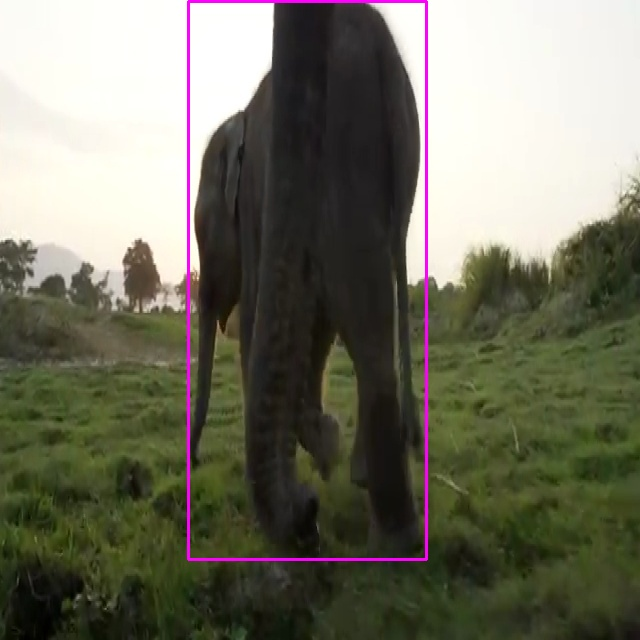

# Derezz

Video indexing with Daft and S3 Tables.

## Setup

```sh
uv sync && source .venv/bin/activate
uv pip install -e .
```

## Usage

**Help**

```sh
usage: derezz [-h] {index,find,ls,open} ...

Video search powered by Daft and S3 Tables.

positional arguments:
  {index,find,ls,open}
    index               Upload this video to the search index.
    find                Find videos with the specific items.
    ls                  List indexed labels.
    open                Open the search hits as images.

options:
  -h, --help            show this help message and exit

**Index a YouTube Video**

```sh
$ derezz index 'https://www.youtube.com/watch?v=c8aFcHFu8QM'
```

**List Features**

```sh
$ derezz ls    

count | labels
------+-------------------
 1002 | bird
  209 | person
  191 | horse
  157 | bear
   75 | cow
   57 | elephant
   50 | vase
   47 | dog
   28 | giraffe
   24 | surfboard
   19 | sheep
   17 | skis
   15 | boat
   13 | airplane
   13 | potted plant
   11 | traffic light
    9 | kite
    4 | broccoli
    4 | cat
    4 | bed
    4 | car
    3 | umbrella
    2 | wine glass
    1 | knife
```

**Find a Feature**

```sh
$ derezz open 'elephant'
```

